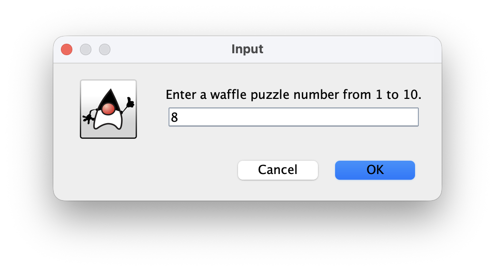
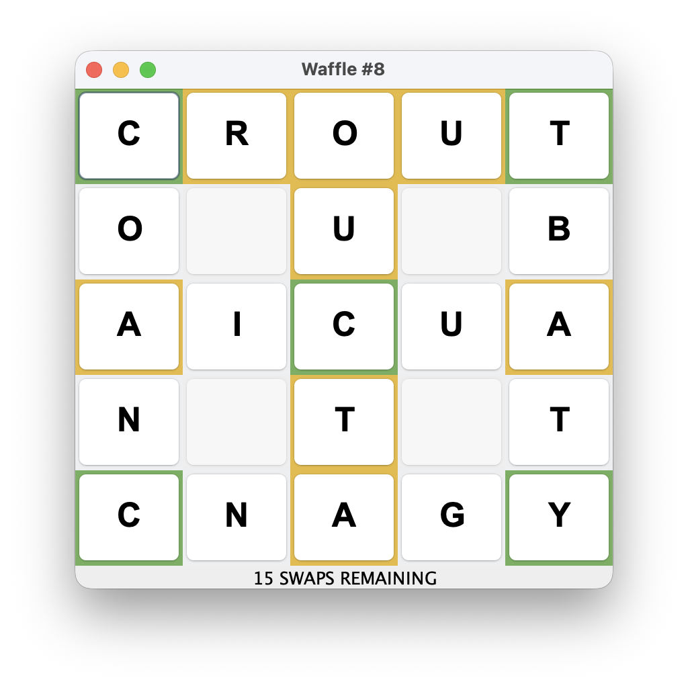
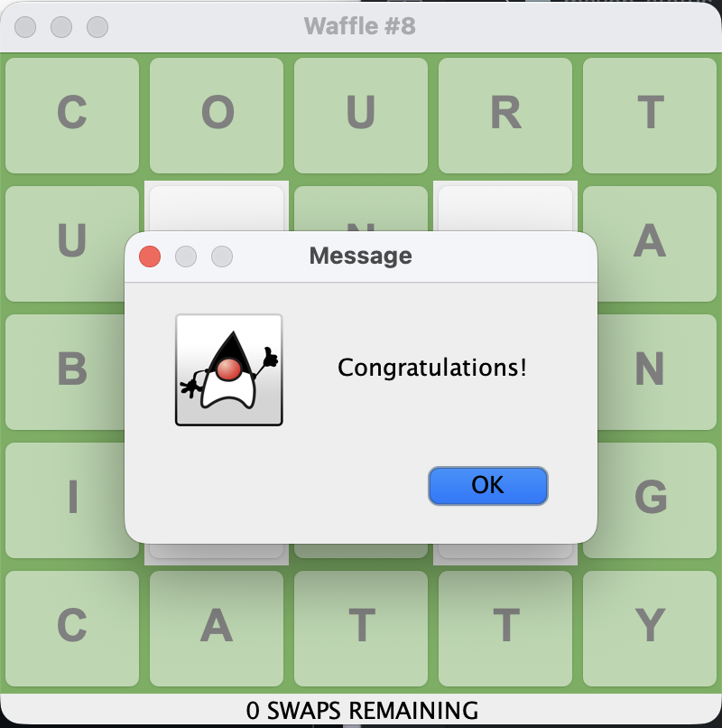

# Waffle Puzzle Game

A Java Swing-based puzzle game inspired by Wordle, where players unscramble six intersecting words on a waffle-shaped grid by swapping letters within a limited number of moves.

---

## 📑 Project Overview

This project is a desktop implementation of the popular web-based Waffle word puzzle. The application is built using Java's Swing toolkit for the graphical user interface. A key focus of this project was to move beyond a simple script and engineer a robust application by refactoring the original codebase into a **Model-View-Controller (MVC)** architecture. This approach separates the core game logic from the user interface, resulting in a more maintainable, scalable, and testable product.

The puzzles used in this game are sourced from the original `wafflegame.net`.

---

## 🎯 Objectives

1.  **Develop a fully functional puzzle game** with an interactive graphical user interface using **Java Swing**.
2.  **Implement core game logic**, including letter swapping, a dynamic hint system (correct, wrong position, not in word), and win-state detection.
3.  **Apply the MVC design pattern** to cleanly separate the game's internal logic (Model) from its presentation (View).
4.  **Ensure code quality and robustness** by developing a test suite with **JUnit** to validate the core game logic.
5.  **Use professional build tooling** by managing the project's build lifecycle and dependencies with **Maven**.

---

## 📁 Project Structure

### Files

- **`pom.xml`**: The Maven project object model file. It defines project dependencies (like JUnit) and configures build plugins.
- **`src/main/java/`**: Contains the primary application source code.
  - `WaffleGUI.java`: The main entry point for the application; responsible for creating the window (`JFrame`).
  - `MainPanel.java`: The primary UI component (`JPanel`) that renders the game grid and handles user input (the **View**).
  - `WaffleGame.java`: The core class containing all game logic, state, and rules (the **Model**).
  - `Hint.java`: An `enum` that defines the three hint states: `CORRECT`, `WRONG_POSITION`, and `NOT_IN_WORD`.
- **`src/main/resources/`**: Contains non-code resources.
  - `waffles.txt`: The text file containing puzzle and solution data.
- **`src/test/java/`**: Contains the testing source code.
  - `WaffleGameTest.java`: A suite of **JUnit** tests for the `WaffleGame` model class.

---

## 🚀 Running the Code

**Prerequisites**:

- Java Development Kit (JDK) 11 or higher
- Apache Maven

**Instructions**:

1.  Clone the repository:
    ```bash
    git clone https://github.com/your-username/waffle-game.git
    cd waffle-game
    ```
2.  Compile the project:
    ```bash
    mvn compile
    ```
3.  Run the JUnit tests to verify the logic:
    ```bash
    mvn test
    ```
4.  Run the application:
    ```bash
    mvn exec:java
    ```

---

## ✨ Key Features

- **Interactive GUI**: A clean, responsive graphical interface built with **Java Swing**.
- **Dynamic Hint System**: Tiles are instantly color-coded after each swap to provide feedback on letter placement.
- **MVC Architecture**: A well-structured codebase where the game's logic is fully decoupled from the UI, following professional design patterns.
- **External Puzzle Data**: Puzzles are loaded from an external `waffles.txt` file, allowing for easy updates and additions.
- **Move Counter**: With a limit of 15 swaps, the game provides a fun and challenging experience.

---

## 📸 Screenshots

**Game Start:**


**Game in Progress:**


**Winning State:**

